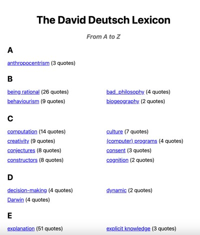

# The David Deutsch Dictionary
## Introduction
This is the source code for my interactive dictionary of quantum physics researcher and prolific author David Deutsch. Deutsch's work has wide-ranging implications in fields as different as computer science and epistemology. You can check it out at [rational.vkethana.com](https://rational.vkethana.com).
## How It Works
- `get_data.py`: The quotes are pulled from a Google Sheet database which you can check out [here](https://docs.google.com/spreadsheets/d/1xTxusR0Mfy5eE5vbe8wjIAVwvfojvHzCse_J_fUteZc/edit#gid=0). I used the `gspread` Python library	to pull data from the spreadsheet and put it into a Pandas dataframe. 
-	`app.py`: This file handles the Flask app which serves the dictionary. Quotes are listed in alphabetical order by keyword, like so:

The codebase is not that big and should be fairly snappy, since most of the libraries in use (Flask, gspread)	are lightweight.
## How You Can Contribute
If you want to suggest new quotes to be added to the dictionary, you can leave a comment on the Google sheet. 
Suggestions for optimizing the code are also welcome.
